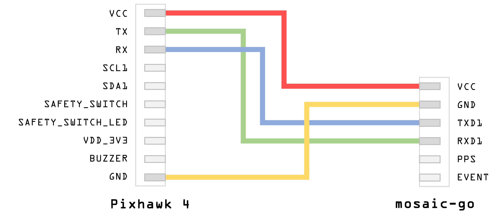
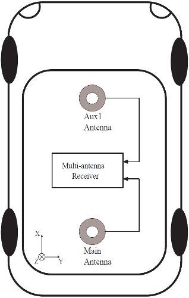
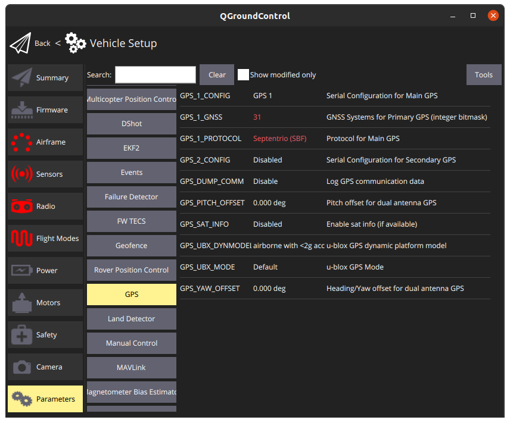

# PX4 Autopilot

This repository is a fork from the official [PX4-Autopilot](https://github.com/PX4/PX4-Autopilot) with verified drivers for Septentrio receivers.
PX4 is highly portable, OS-independent and supports Linux, NuttX and MacOS out of the box.

- Official Website: http://px4.io (License: BSD 3-clause, LICENSE)
- Supported airframes (portfolio):
  - Multicopters
  - Fixed wing
  - VTOL
  - Autogyro
  - Rover
  - many more experimental types (Blimps, Boats, Submarines, High altitude balloons, etc)

## Building a PX4 based drone, rover, boat or robot

The [PX4 User Guide](https://docs.px4.io/master/en/) explains how to assemble [supported vehicles](https://docs.px4.io/master/en/airframes/airframe_reference.html) and fly drones with PX4.
See the [forum and chat](https://docs.px4.io/master/en/#support) if you need help!

### Releases
The releases on this repository are verified by Septentrio. Every Septentrio release ends with "-septentrio". Other releases are verified by PX4 but may not support Septentrio receivers. 

On the release page you can download the builds for every default supported boards. Just upload this build to your board using QGroundControl and you are ready to fly!

_To see the changes from a specific release, go to the release page and open the "Full Changelog" link._
## Building your own code
If you made changes to the code and want to build it yourself, you first have to set up a developer environment. Check [Setting up a Developer Environment](https://docs.px4.io/master/en/dev_setup/dev_env.html) on how to do so. It is recommended to use Ubuntu Linux as the devopment platform.

After you have the developer environment set up, run the make command with the right build target.
ex:
* Pixhawk4: `make px4_fmu-v5_default`

For other build targets and simulations, visit the [Building PX4 Software](https://docs.px4.io/master/en/dev_setup/building_px4.html) page on the PX4 user guide.

## Supported Hardware

This repository contains code supporting Pixhawk standard boards (best supported, best tested, recommended choice) and proprietary boards.

### Septentrio Receivers

* [mosaic-go heading GNSS module evaluation kit](https://web.septentrio.com/l/858493/2022-04-19/xgrp9)
* [mosaic-go GNSS module receiver evaluation kit](https://web.septentrio.com/l/858493/2022-04-19/xgrpd)
* [AsteRx-m3 Pro](https://web.septentrio.com/l/858493/2022-04-19/xgrrz)
* [AsteRx-m3 Pro+](https://web.septentrio.com/l/858493/2022-04-19/xgrs3)

### Pixhawk Standard Boards
* FMUv5 and FMUv5X (STM32F7, 2019/20)
    * [Pixhawk 4 (FMUv5)](https://docs.px4.io/master/en/flight_controller/pixhawk4.html)
    * [Pixhawk 4 mini (FMUv5)](https://docs.px4.io/master/en/flight_controller/pixhawk4_mini.html)
    * [CUAV V5+ (FMUv5)](https://docs.px4.io/master/en/flight_controller/cuav_v5_plus.html)
    * [CUAV V5 nano (FMUv5)](https://docs.px4.io/master/en/flight_controller/cuav_v5_nano.html)
    * [Auterion Skynode (FMUv5X)](https://docs.px4.io/master/en/flight_controller/auterion_skynode.html)
* FMUv4 (STM32F4, 2015)
    * [Pixracer](https://docs.px4.io/master/en/flight_controller/pixracer.html)
    * [Pixhawk 3 Pro](https://docs.px4.io/master/en/flight_controller/pixhawk3_pro.html)
* FMUv3 (STM32F4, 2014)
    * [Pixhawk 2](https://docs.px4.io/master/en/flight_controller/pixhawk-2.html)
    * [Pixhawk Mini](https://docs.px4.io/master/en/flight_controller/pixhawk_mini.html)
    * [CUAV Pixhack v3](https://docs.px4.io/master/en/flight_controller/pixhack_v3.html)
* FMUv2 (STM32F4, 2013)
    * [Pixhawk](https://docs.px4.io/master/en/flight_controller/pixhawk.html)
    * [Pixfalcon](https://docs.px4.io/master/en/flight_controller/pixfalcon.html)

Additional information about supported hardware can be found in [PX4 user Guide > Autopilot Hardware](https://docs.px4.io/master/en/flight_controller/).

## User Guide

### Hardware setup mosaic-go

1. Make sure the receiver is powered with at least 3.3V. You can use the micro USB connector or the 6-pin connector.
2. Connect one or two GNSS antennas to the RF-IN ports on the mosaic-go.
3. Connect the 6-pin connector (COM1) to the Pixhawk's `GPS MODULE` port. This will provide power to the mosaic-go and with
   this single connection it will be able to send single and dual antenna information to the Pixhawk 4.
4. In the web interface or with Rx Tools, set the receiver's baud rate to 115200 **Admin > Expert Control > Control Panel > Communication > COM Port Settings** (this is the default value).

**Make sure the JST cable is wired correctly (since this is not a standard cable):**

_PX4 will ensure that the GNSS module is automatically configured however, if you have a dual antenna setup, it
is required to set the layout as accurately as possible in the web app._

#### Dual antenna

The attitude (heading/pitch) can be computed from the orientation of the baseline between the main and the aux1 GNSS antennas.

To enable multi-antenna attitude determination, follow the following procedure:

1. Attach two antennas to your vehicle, using cables of approximately the same length. The default antenna configuration is as depicted in the figure.
   It consists in placing the antennas aligned with the longitudinal axis of the vehicle, main antenna behind aux1.
   For best accuracy, try to maximize the distance between the antennas, and avoid significant height difference between the antenna ARPs.
2. In practice, the two antenna ARPs may not be exactly at the same height in the vehicle frame, or the main-aux1 baseline may not be exactly parallel or perpendicular to the longitudinal axis of the vehicle. This leads to offsets in the computed attitude angles.
   These offsets can be compensated for with the **setAttitudeOffset** command.

_For optimal heading results, the two antennas should be seperated by at least 30cm / 11.8 in (ideally 50cm /
19.7in or more)_

_For additional configuration of the dual antenna setup, please refer to
our [Knowledge Base](https://support.septentrio.com/l/858493/2022-04-19/xgrqd) or the [hardware manual](https://web.septentrio.com/l/858493/2022-04-19/xgrql)_ 

#### Web app

mosaic-H GPS/GNSS receiver module with heading comes with fully documented interfaces, commands and data messages. The
included GNSS receiver control and analysis software [RxTools](https://web.septentrio.com/l/858493/2022-04-19/xgrqp)
allows receiver configuration, monitoring as well as data logging and analysis.

The receiver includes an intuitive web user interface for easy operation and monitoring allowing you to control the
receiver from any mobile device or computer. The web interface also uses easy-to-read quality indicators ideal to
monitor the receiver operation during the job at hand.

### PX4 setup

#### Single antenna

Edit the following parameters in the GPS tab:

- [GPS_1_CONFIG](https://docs.px4.io/master/en/advanced_config/parameter_reference.md#GPS_1_CONFIG): GPS 1
- [GPS_1_GNSS](https://docs.px4.io/master/en/advanced_config/parameter_reference.md#GPS_1_GNSS): 31
- [GPS_1_PROTOCOL](https://docs.px4.io/master/en/advanced_config/parameter_reference.md#GPS_1_PROTOCOL): Auto detect (or SBF)
- [SER_TEL1_BAUD](https://docs.px4.io/master/en/advanced_config/parameter_reference.md#SER_TEL1_BAUD): 115200 8N1

Go to **Tools > Reboot Vehicle**

#### Dual antenna

Edit the following parameters in the GPS tab:

- [GPS_1_CONFIG](https://docs.px4.io/master/en/advanced_config/parameter_reference.md#GPS_1_CONFIG): TELEM1
- [GPS_1_GNSS](https://docs.px4.io/master/en/advanced_config/parameter_reference.md#GPS_1_GNSS): 31
- [GPS_1_PROTOCOL](https://docs.px4.io/master/en/advanced_config/parameter_reference.md#GPS_1_PROTOCOL): Auto detect (or SBF)
- [SER_TEL1_BAUD](https://docs.px4.io/master/en/advanced_config/parameter_reference.md#SER_TEL1_BAUD): 115200 8N1
- [EKF2_AID_MASK](https://docs.px4.io/master/en/advanced_config/parameter_reference.md#EKF2_AID_MASK): Use GPS & GPS yaw fusion (129)
- [GPS_PITCH_OFFSET](https://docs.px4.io/master/en/advanced_config/parameter_reference.md#GPS_PITCH_OFFSET): set according to your setup
- [GPS_YAW_OFFSET](https://docs.px4.io/master/en/advanced_config/parameter_reference.md#GPS_YAW_OFFSET): set according to your setup

Go to **Tools > Reboot Vehicle**

### LED Status

| LED Color     |  Powered  | SD card mounted | PVT Solution | Logging enabled |
|---------------|:---------:|:---------------:|:------------:|:---------------:|
| Red           | &check;️  |                 |              |                 |
| Green         | &check;️  |    &check;️     |              |                 |
| Blue          | &check;️  |    &check;️     |   &check;️   |                 |
| Purple        | &check;️  |                 |   &check;️   |                 |
| Purple + Blue | &check;️  |    &check;️     |   &check;️   |    &check;️     |
| Red + Green   | &check;️  |    &check;️     |              |    &check;️     |

For more detailed information about the mosaic-go and its module, please refer to the [hardware manual](https://web.septentrio.com/l/858493/2022-04-19/xgrrd) or the [Septentrio Support](https://support.septentrio.com/l/858493/2022-04-19/xgrrl) page.

